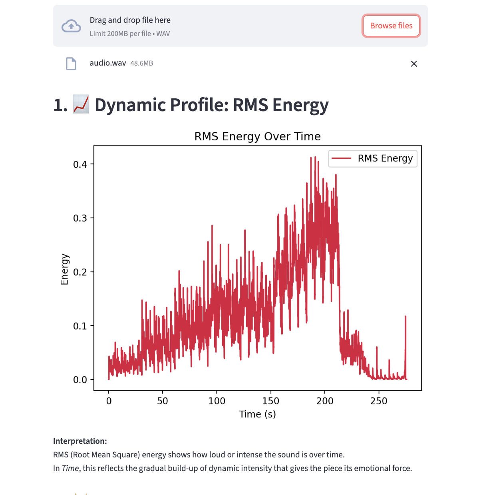

# Structural Music Feature Explorer



## 📄 What This Project Was About

This analysis was part of a broader report completed for [HUM-274](https://edu.epfl.ch/coursebook/en/musical-theory-and-creativity-HUM-274), exploring how Zimmer’s *Time* builds emotional intensity not through harmonic complexity or melodic variation, but through subtle changes in texture, repetition, and perceived motion. 

The visualizations helped illustrate my main argument: that musical movement can be deeply felt even when very little changes on the surface.

[Read the Full Essay](essay.pdf)  

[](https://www.youtube.com/watch?v=7YFJ3JSFubU)


## 🎧 Try It Yourself

Want to try a similar analysis on another piece?  
To launch the interactive analysis interface, make sure you've installed the required packages:

```bash
pip install -r requirements.txt
streamlit run main.py
```

This will open a browser window where you can upload a `.wav` file and view the full audio feature analysis. This framework works especially well for music with clear builds, minimalism, or evolving textures.

Happy listening and analyzing!